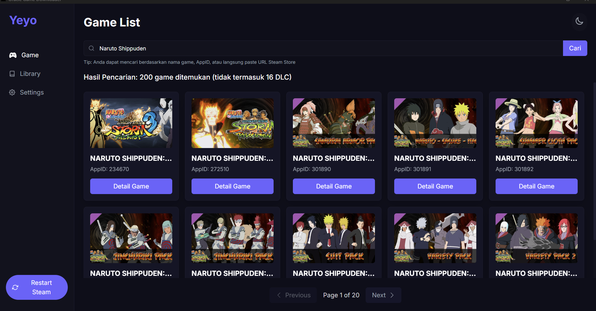
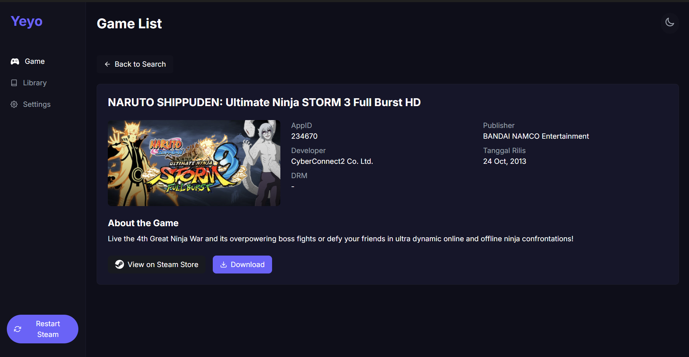
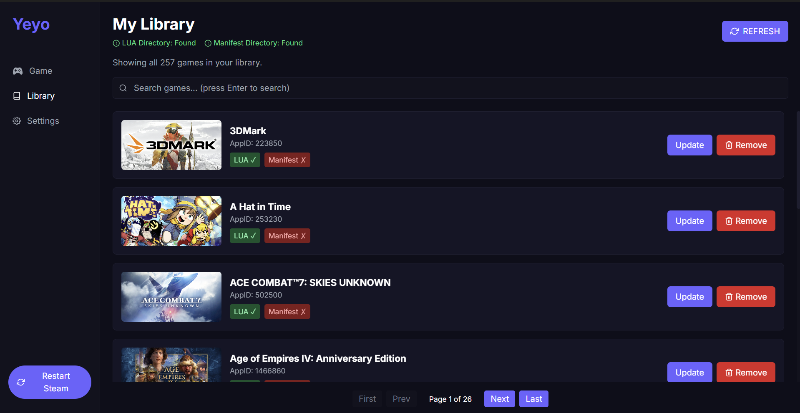

# Oracle Downloader

<p align="center">
  
</p>

<p align="center">
  <strong>A powerful Steam game data downloader with a modern interface</strong>
</p>

<p align="center">
  <a href="#screenshots">Screenshots</a> •
  <a href="#features">Features</a> •
  <a href="#installation">Installation</a> •
  <a href="#usage">Usage</a> •
  <a href="#how-it-works">How It Works</a> •
  <a href="#development">Development</a>
</p>

Oracle Downloader is a cross-platform application built with Rust and Tauri that allows you to download game data from GitHub repositories using Steam AppIDs. It features a modern React-based UI with a dark theme and provides an intuitive way to search, download, and manage game files.

## Screenshots

<p align="center">
  
  &nbsp;&nbsp;
  
</p>

<p align="center">
  
</p>

## Features

- **Modern UI**: Clean, responsive interface with dark theme
- **Game Search**: Search games by name or AppID
- **Game Details**: View detailed information about games
- **Download Management**: Download game data directly from GitHub repositories
- **Library View**: Browse and manage your downloaded games
- **Persistent Settings**: Save your preferred download directory
- **Steam Integration**: Restart Steam directly from the app
- **Multiple Repository Support**: Downloads from various GitHub repositories
- **Cross-Platform**: Works on Windows, macOS, and Linux

## Installation

### Pre-built Binaries

Download the latest release for your platform from the [Releases](https://github.com/yourusername/oracle-downloader/releases) page.

### Building from Source

```bash
# Clone the repository
git clone https://github.com/yourusername/oracle-downloader.git
cd oracle-downloader

# Install dependencies
npm install

# Build the application
npm run tauri build
```

## Usage

### Game Search

1. Enter a game name or AppID in the search bar
2. Click on a game card to view details
3. Click the "Download" button to download game data

### Library Management

1. Navigate to the "Library" tab to view your downloaded games
2. Use the "Update" button to update game files
3. Use the "Remove" button to delete game files

### Settings Configuration

1. Navigate to the "Settings" tab
2. Set your preferred download directory
3. Click "Save" to persist your settings

## How It Works

1. The application searches for games using the Steam API
2. When downloading, it attempts to fetch data from multiple GitHub repositories
3. Downloaded files are stored in your configured directory
4. The application extracts and processes the files for use with Steam
5. Files are automatically moved to the appropriate Steam directories:
   - LUA files: `C:\Program Files (x86)\Steam\config\stplug-in`
   - Manifest files: `C:\Program Files (x86)\Steam\config\depotcache`
   - BIN files: `C:\Program Files (x86)\Steam\config\StatsExport`

## Development

### Project Structure

```
oracle-downloader/
├── src/                   # Frontend React code
│   ├── components/        # React components
│   │   └── utils/             # Utility functions
│   ├── hooks/             # Custom React hooks
│   └── utils/             # Utility functions
├── src-tauri/             # Rust backend code
│   ├── src/               # Rust source files
│   │   ├── commands.rs    # Tauri commands
│   │   ├── models.rs      # Data models
│   │   └── main.rs        # Main entry point
│   └── Cargo.toml         # Rust dependencies
├── public/                # Static assets
└── screenshots/           # Screenshots for README
```

### Technologies Used

- **Frontend**: React, TailwindCSS
- **Backend**: Rust, Tauri
- **APIs**: Steam API, GitHub API
- **Libraries**:
  - tokio - Asynchronous runtime
  - reqwest - HTTP client
  - serde - Serialization/deserialization
  - walkdir - Directory traversal
  - once_cell - Global state management

### Building for Development

```bash
# Run in development mode
npm run tauri dev

# Build for production
npm run tauri build
```

## License

This project is licensed under the MIT License - see the [LICENSE](LICENSE) file for details.

## Acknowledgments

- [Steam API](https://steamcommunity.com/dev) for game data
- [Tauri](https://tauri.app/) for the application framework
- [React](https://reactjs.org/) for the frontend framework
- [TailwindCSS](https://tailwindcss.com/) for styling 